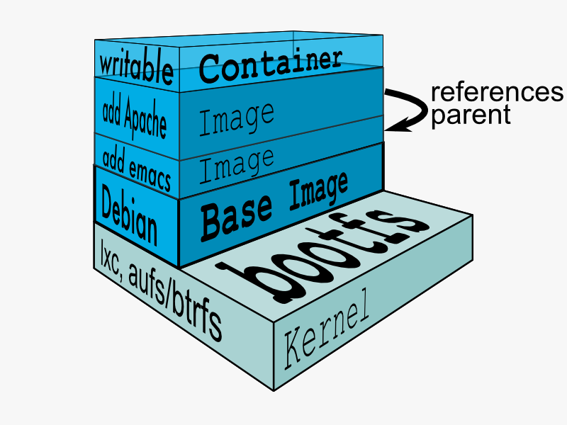

# Python in Docker

---

# About me
Werner Mendizabal
-----------------

- OpenStack Developer at Rackspace
    - OpenStack Keystone - https://github.com/openstack/keystone

- IRC - nonameentername on Freenode

- Twitter @nonameentername

- GitHub - https://github.com/nonameentername

---

# What is docker?

- Docker is an open platform for developers and sysadmins to build, ship, and run distributed applications

    - https://www.docker.com

---

# Docker Architecture

---

# Fig

- Fast, isolated development environments using Docker
    - http://www.fig.sh
    - Install: pip install fig

---

# Dockerfile

    !bash
    # demo
    #
    # VERSION               0.1

    FROM ubuntu:14.04
    MAINTAINER Werner R. Mendizabal "werner.mendizabal@gmail.com"

    RUN apt-get install -y python-pip

    ADD . /code

    WORKDIR /code

    RUN python setup.py install

    EXPOSE 8080

    CMD python -m demo.app

---

# fig.yml

    !yaml
    riak:
        image: werner/riak
        ports:
            - 8087:8087
            - 8098:8098

    app:
        build: .
        ports:
            - 8080:8080
        links:
            - riak

---

# Demo
Docker time

---

# QA

