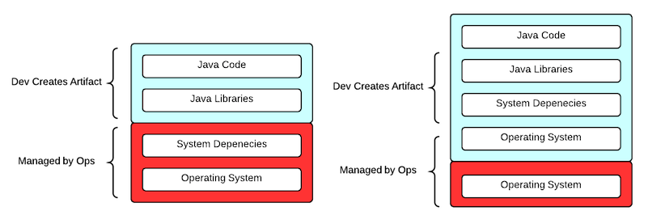

# About me
    Werner Mendizabal
    Rackspace - Cloud Identity (keystone)

    https://github.com/nonameentername
    werner.mendizabal@gmail.com

---

# Dockerfy your CI/CD

---

# Problem description
- Internal product consumers need to test multiple versions of the Rackspace's
  Cloud Identity API
- Limited hardware resources
- Difficult for consumers to switch between different versions of the API
- Flexibility create/destroy
- Consistency

---

# What is docker?

- Docker: The Linux Container Engine

  Docker is an open-source project to easily create lightweight, portable, self-sufficient
  containers from any application. The same container that a developer builds and tests on 
  a laptop can run at scale, in production, on VMs, bare metal, OpenStack clusters, public
  clouds and more. 
---

# Docker Architecture

---

# Dockerfile
    !bash
    # nexus
    #
    # VERSION               1.0.0
    FROM ubuntu:12.04
    MAINTAINER Werner R. Mendizabal "werner.mendizabal@gmail.com"

    RUN echo "deb http://archive.ubuntu.com/ubuntu precise main universe" \
    > /etc/apt/sources.list
    RUN apt-get update
    RUN apt-get install -y openjdk-7-jre-headless
    WORKDIR /usr/local
    RUN wget http://www.sonatype.org/downloads/nexus-latest-bundle.tar.gz
    RUN tar zxvf nexus-latest-bundle.tar.gz
    RUN mv /usr/local/nexus-2.7.0-05 /usr/local/nexus
    WORKDIR /usr/local/nexus
    EXPOSE 8081
    VOLUME ["/usr/local/sonatype-work/nexus/storage"]
    CMD RUN_AS_USER=root ./bin/nexus start && tail -f logs/wrapper.log

---

# Application Package

---

# Cloud Identity application
Application is self contained

each git revision contains:

- application code
- application config files
- database schema and config
- required database data

---

# Docker images
Images stored in a private docker registry:

- application-base-image
- backend-base-image
- nexus
- riak

Images built on demand:

- application
- backend

---

# Docker images

Dockerfile

    !bash
    # backend-base-image
    #
    # VERSION               1.0.0
    FROM ubuntu:12.04

    RUN install.sh
    VOLUME ["/schema", "/data"]

Dockerfile

    !bash
    # backend
    #
    # VERSION               1.0.0
    FROM backend-base-image

    ADD /schema /schema
    ADD /data /data

---

# Docker images

Dockerfile

    !bash
    # application-base-image
    #
    # VERSION               1.0.0
    FROM ubuntu:12.04

    RUN install.sh
    VOLUME ["/config", "/war"]

Dockerfile

    !bash
    # application
    #
    # VERSION               1.0.0
    FROM application-base-image

    ADD /config /config
    ADD /war /war

---

# Architecture of Docker solution
bottle service:

- docker-py
- riak
- angularjs
- command line client

---

# Architecture of Docker solution

---

# Architecture of Docker solution
    !python
    @get('/IDaaS/versions')
    @get('/IDaaS/versions/<version>')
    @post('/IDaaS/apps')
    @get('/IDaaS/apps')
    @get('/IDaaS/apps/<application_id>')
    @get('/IDaaS/hosts/<host_id>/log')
    @delete('/IDaaS/apps/<application_id>')
    @get('/')
    @get('/static/<path:path>')

---

# Architecture of Docker solution
    !python
    from docker import Client

    def get_riak_ip():
        docker = Client()
        for container in docker.containers():
            container_id = container['Id']
            info = docker.inspect_container(container_id)
            if info['Config']['Image'] == 'riak':
                return info['NetworkSettings']['IPAddress']
        return riak_instance['ip']

---

# Architecture of Docker solution
    !python
    from riak import RiakClient

    def create_instance(version, tag):
        riak = RiakClient(host=get_riak_ip())
        apps = riak.bucket('apps')

        data = {
            'version': version,
            'tag': tag
        }

        application = apps.new(data=json.dumps(data))
        application.store()

        response = docker.create_container("application")
        docker.start(response)

        info = docker.inspect_container(response)
        return info['Name']

---

# Identity CI/CD pipeline
    for github repository
    create a new branch
    submit pull request
    jenkins job started via github hook
    jenkins creates new artifact nexus
    jenkins creates new docker instance of the database using nexus artifact
    jenkins runs test
    jenkins notifies github on success or failure of the job
    merge back into master
    jenkins merge job

---

# Demo
Docker time

---

# Future Improvements
Run service on a cluster of nodes (Apache Mesos?)

Allow more complex deployments

Recover from node failure: spin up new nodes and assign same ip (Open vSwitch)

---

# QA

